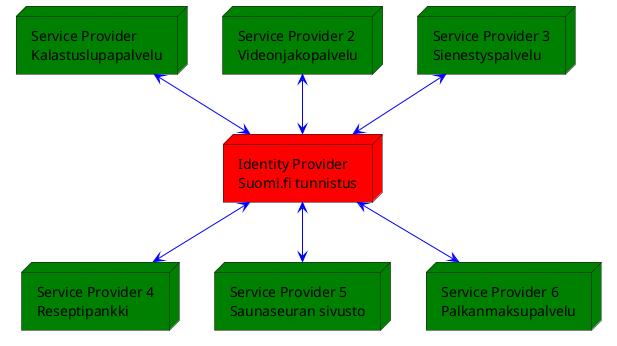

:hammer: **Sivusto on hyvin keskeneräinen** :hammer:

# SAML Selitettynä

SAML:ia ei voi selittää.

Mutta yritän kuitenkin.

SAML *(Security Assertion Markup Language)* on kirjautumisprotokolla jossa kaikki liikenne tapahtuu selaimen kautta. SAML ei siis tee yhtäkään *server-to-server* pyyntöä ja SAML:in turvallisuus perustuu allekirjoituksiin ja kryptografiaan. Kaikki pyynnöt välitetään siis käyttäjän selaimen kautta.

SAML on aivan uskomaton kasa erilaisia lyhenteitä, mutta loppujen lopuksi kyse on aika yksinkertaisesta asiasta.

SAML:iin liittyy kaksi tärkeää ymmärrettävää asiaa: IdP ja SP.

## IdP (Identity Provider)

IdP on palvelu joka vastaa identiteetistä ja tarjoaa näitä identiteettejä hyödyntäville palveluille. Suomi.fi kontekstissa IdP on siis suomi.fi tunnistuspalvelu. Sinä luultavasti et tee IdP:tä (ellet ole suomi.fi palvelun tekemisessä mukana ja päätynyt tänne mielenkiinnosta :wave:).

> Kun puhutaan IdP:stä, tarkoitetaan suomi.fi tunnistus palvelua johon sinä et voi vaikuttaa mitenkään.

## SP (Service Provider)

SP on palvelu, jota **sinä** teet. Service Provider ei halua olla vastuussa esimerkiksi käyttäjien salasanojen tallentamisesta oikein ja turvallisesti, vaan se vastuu työnnetään IdP:n vastuulle. Service Provider siis käyttää Identity Providerin tarjoamaa identiteettiä.

> Kun puhutaan SP:stä, tarkoitetaan **sinua** ja sinun palveluasi jota tunnistautunut käyttäjä varsinaisesti käyttää.

Voidaan siis ajatella, että IdP:itä on yksi ja SP:itä useampi. SP:n ja IdP:n välille luodaan **luottamussuhde**, joka tapahtuu vaihtamalla metadata. Allaolevasta kuvassa IdP:llä on jokaisen SP:n metadata itsellään ja jokaisella SP:llä on IdP:n metadata. Luonnollisesti SP:illä ei ole keskenään mitään linkkiä, paitsi se, että kun käyttäjä on kirjautunut yhteen palveluun, hän on taijanomaisesti kirjautunut kaikkiin palveluihin. SAML on siis yleensä *single sign-on* (SSO) palvelu, mutta ei välttämättä. Suomi.fi tunnistus kuitenkin on SSO.

Luottamussuhde IdP:n ja SP:n välillä luodaan välittämällä SP:n metadata IdP:lle. Tämän lisäksi SP voi hyödyntää IdP:n metadataa konfiguraatiossaan.

# Muista nämä

* Kaikki liikenne tapahtuu käyttäjän selaimen kautta
* Sinä olet melko varmasti Service Provider
* SAML vaatii aina luottamussuhteen rakentamista IdP:n ja SP:n välille
* Suomi.fi tunnistus on SSO palvelu, eli *single sign-on*