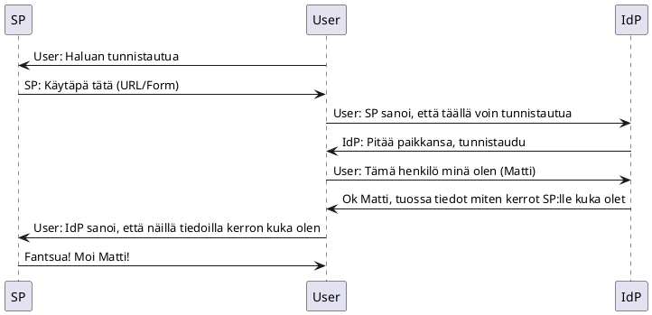

:hammer: **Sivusto on hyvin keskeneräinen** :hammer:

# SP Metadata

Suomi.fi tunnistuksessa on mahdollista lisätä neljä (4) ympäristöä:

* Kehitysympäristö
* Testiympäristö
* Hyväksyntätestiympäristö
* Tuotantoympäristö

Neljän ympäristön luominen SP:lle ei ole pakollista, mutta enempää kuin neljä et voi saada. Jokaisella ympäristöllä on oma metadatansa. Tuotantoypäristössä on muutama lisävaatimus suhteessa testiympäristöihin, mutta niistä lisää myöhemmin.

Service Provider kertoo Identity Providerille palvelustaan metadatalla. Tämä metadata on käytännössä melkoinen läjä XML:ää.

Ei kannata huolestua. Tässä se on. Kuvitellaan, että SP:mme on vaikka sienestyspalvelu ja se tarjoillaan käyttäjille osoitteesta `https://sienestyspalvelu.fi`, mutta nyt olemme vasta integroimassa `dev` ympäristöä suomi.fi tunnistukseen ja tämä ympäristö majailee osoitteessa `https://dev.sienestyspalvelu.fi`. Huomaa, että SSL on pakollinen, eli suomi.fi tunnistusta ei voi käyttää ilman SSL-salausta. Mutta se nyt on muutenkin pakollinen joten ei siitä sen enempää, eli toivottavasti sinulla on jo SSL jutut kunnossa.

Oheisessa XML snippetissä on kommentein `<!-- HUOM! ... -->` kuvattu kohdat, joihin sinun täytyy kiinnittää huomiota ja nämä huomiot on kuvattu tarkemmin myöhemmin sivulla.

```xml
<?xml version="1.0"?>
<!-- HUOM! 1. entityID attribuutti on tärkeä -->
<md:EntityDescriptor xmlns:md="urn:oasis:names:tc:SAML:2.0:metadata" entityID="https://dev.sienestyspalvelu.fi/SAML2SP">
    <md:Extensions xmlns:alg="urn:oasis:names:tc:SAML:metadata:algsupport">
        <mdattr:EntityAttributes xmlns:mdattr="urn:oasis:names:tc:SAML:metadata:attribute">
            <saml:Attribute xmlns:saml="urn:oasis:names:tc:SAML:2.0:assertion" Name="FinnishAuthMethod" NameFormat="urn:oasis:names:tc:SAML:2.0:attrname-format:uri">
                <saml:AttributeValue xmlns:xs="http://www.w3.org/2001/XMLSchema" xmlns:xsi="http://www.w3.org/2001/XMLSchema-instance" xsi:type="xs:string">http://ftn.ficora.fi/2017/loa3</saml:AttributeValue>
                <saml:AttributeValue xmlns:xs="http://www.w3.org/2001/XMLSchema" xmlns:xsi="http://www.w3.org/2001/XMLSchema-instance" xsi:type="xs:string">http://eidas.europa.eu/LoA/high</saml:AttributeValue>
                <saml:AttributeValue xmlns:xs="http://www.w3.org/2001/XMLSchema" xmlns:xsi="http://www.w3.org/2001/XMLSchema-instance" xsi:type="xs:string">http://ftn.ficora.fi/2017/loa2</saml:AttributeValue>
                <saml:AttributeValue xmlns:xs="http://www.w3.org/2001/XMLSchema" xmlns:xsi="http://www.w3.org/2001/XMLSchema-instance" xsi:type="xs:string">http://eidas.europa.eu/LoA/substantial</saml:AttributeValue>
                <saml:AttributeValue xmlns:xs="http://www.w3.org/2001/XMLSchema" xmlns:xsi="http://www.w3.org/2001/XMLSchema-instance" xsi:type="xs:string">urn:oid:1.2.246.517.3002.110.999</saml:AttributeValue>
            </saml:Attribute>
            <saml:Attribute xmlns:saml="urn:oasis:names:tc:SAML:2.0:assertion" FriendlyName="VtjVerificationRequired" Name="urn:oid:1.2.246.517.3003.111.3" NameFormat="urn:oasis:names:tc:SAML:2.0:attrname-format:uri">
                <saml:AttributeValue xmlns:xs="http://www.w3.org/2001/XMLSchema" xmlns:xsi="http://www.w3.org/2001/XMLSchema-instance" xsi:type="xs:string">true</saml:AttributeValue>
            </saml:Attribute>
            <saml:Attribute xmlns:saml="urn:oasis:names:tc:SAML:2.0:assertion" FriendlyName="SkipEndpointValidationWhenSigned" Name="urn:oid:1.2.246.517.3003.111.4" NameFormat="urn:oasis:names:tc:SAML:2.0:attrname-format:uri">
                <saml:AttributeValue xmlns:xs="http://www.w3.org/2001/XMLSchema" xmlns:xsi="http://www.w3.org/2001/XMLSchema-instance" xsi:type="xs:string">false</saml:AttributeValue>
            </saml:Attribute>
            <saml:Attribute xmlns:saml="urn:oasis:names:tc:SAML:2.0:assertion" FriendlyName="EidasSupport" Name="urn:oid:1.2.246.517.3003.111.14" NameFormat="urn:oasis:names:tc:SAML:2.0:attrname-format:uri">
                <saml:AttributeValue xmlns:xs="http://www.w3.org/2001/XMLSchema" xmlns:xsi="http://www.w3.org/2001/XMLSchema-instance" xsi:type="xs:string">full</saml:AttributeValue>
            </saml:Attribute>
        </mdattr:EntityAttributes>
    </md:Extensions>
    <!-- HUOM! 2. sertifikaatit -->
    <md:SPSSODescriptor AuthnRequestsSigned="true" WantAssertionsSigned="true" protocolSupportEnumeration="urn:oasis:names:tc:SAML:2.0:protocol">
        <md:KeyDescriptor use="signing"> 
            <!-- Allekirjoittamisen serttifikaatti -->
            <dsig:KeyInfo xmlns:dsig="http://www.w3.org/2000/09/xmldsig#">
                <dsig:X509Data>
                    <dsig:X509Certificate>
                        MIIFEDCCAvgCCQCYnsyGAAkC7jANBgkqhkiG9w0BAQsFADBKMQswCQYDVQQGEwJm
                        aTEZMBcGA1UECgwQU2llbmVzdHlzcGFsdmVsdTEgMB4GA1UEAwwXZGV2LnNpZW5l
                        c3R5c3BhbHZlbHUuZmkwHhcNMjAxMTIzMTc0MzEzWhcNMjExMTIzMTc0MzEzWjBK
                        MQswCQYDVQQGEwJmaTEZMBcGA1UECgwQU2llbmVzdHlzcGFsdmVsdTEgMB4GA1UE
                        AwwXZGV2LnNpZW5lc3R5c3BhbHZlbHUuZmkwggIiMA0GCSqGSIb3DQEBAQUAA4IC
                        DwAwggIKAoICAQDSgEutNjPrPtyjoQsWO8L/Z4L8orC+rbKNWb9dxC347uEHwtlE
                        QuWKQAvy6LPmb0CvHZPGjt+Ei3rkF3gFDAR9yuxvuvaJ5aTO1dh23OO5xrIbRv+2
                        6c5cUMC9c5sUQmTRVI8jvpLI+DLy2hgRuGEwpI9O6oVYI8Qgqa4POuh8UctXKhQ9
                        ewXlhpOv1CFo8iRwEAhflloQV38maWLMCUG42FWiPK0pc4FuDH63kqMxU4OWXD0M
                        QrRL2tSIp5HE3g7ozlKfNfdlxAfFjE3zpt+qztqBo2IdwMsobNsaZuOlBRzjDe9C
                        glma+fq4mIvdjPukbRjHhJZIykjYwy/SMyfVKFzzTXvE6UT7S6sW3Ed4BYVO9cQ0
                        k3OPYhMtTMqQWL7GVDVpFUrnVnPRlcHRp4To/Zx5GoMbX0qD2DuOHzjscyvOLtMK
                        jZT4kDSyL++vMPTXwDbLDqeYqAHNEVTl87kqNAoyB9Ad9YG2vdOTsRgjxb7VVoDg
                        Y1JnlVEYjeYWNBD/L6uw6bK5/RkH3QigFldVxOI0RJw0i6ORPNoXHUXQxcvmyoSa
                        FMga5ttgwyUunZVTVONBi/WVDB2cGVxeV2Ud1eDDux483cWVbvVmsIm0VDdaA/j+
                        ajMRxxxolMe4gkSlVE1eRwoYlX2xjSEZmIr0luBBp7T6VZPBxY5CsX7fRwIDAQAB
                        MA0GCSqGSIb3DQEBCwUAA4ICAQC7m7cIO0Q/g3lfpFg21X4duO7o2OQKfqHxISaR
                        lUUBuU1OQxOtnnG/3MHqOugiN3QhNAoI4sOUhZkZQtDK3tHuPQH7mGk31wVivO7r
                        ndItbJjtKVXsd/Nfc68jAnvIgQI65qeD0gUMrG79prhlZt01oCYaZqpcjgANaRSg
                        Wd+m2Abi5svyS7ummKmO94dXw/skOBGx90FXPZPOmha4dFbiD8SIRFWBONfob2gH
                        qjZMweYFkRnmrytME2KmWOupEYh0CQvD7Gav7aN0Sn514Yp7lB9LvC1Rf1HWoZ4V
                        sTcBzTmGEN0+ZIJz3Id88JaChSUBJ7hTnk+SYoz7eBPpQezzLesIp0PzDLV+ryL8
                        7VMt2Jgv4QCMkDLOQQwaEehlbb/bEOXZVnrXSTlPePr7ILnjmXClAX8FRWV5rFZO
                        teJZxqbZ1/+GRtlcoLRzhla3WcwPO30zDgs7+YRhIvvRjCYmvcFBcRWWWsoU7cqt
                        H9LaAstqDMm/6LtCtbDD5zCODc3uKVyA9Kk/i3VRSBwxXezsVyrqfMSt7WadERph
                        LAojvUxad5YpGW+ZfIKQEwgTknrH9qcXd7DdkPlX6H2/kMXnVaXhNMoBR5QXltxk
                        47+7WqT0rPxbH7Ps2tNBtt3zRtEkSy/Q87lGDPoQVh5iXZizIKr0p8hPM4JVeqQh
                        2hKvRQ==
                    </dsig:X509Certificate>
                </dsig:X509Data>
            </dsig:KeyInfo>
        </md:KeyDescriptor>
        <md:KeyDescriptor use="encryption">
            <!-- Kryptaamisen sertifikaatti -->
            <dsig:KeyInfo xmlns:dsig="http://www.w3.org/2000/09/xmldsig#">
                <dsig:X509Data>
                    <dsig:X509Certificate>
                        MIIFEDCCAvgCCQCcRqqvIZm0rTANBgkqhkiG9w0BAQsFADBKMQswCQYDVQQGEwJm
                        aTEZMBcGA1UECgwQU2llbmVzdHlzcGFsdmVsdTEgMB4GA1UEAwwXZGV2LnNpZW5l
                        c3R5c3BhbHZlbHUuZmkwHhcNMjAxMTIzMTc0ODI3WhcNMjExMTIzMTc0ODI3WjBK
                        MQswCQYDVQQGEwJmaTEZMBcGA1UECgwQU2llbmVzdHlzcGFsdmVsdTEgMB4GA1UE
                        AwwXZGV2LnNpZW5lc3R5c3BhbHZlbHUuZmkwggIiMA0GCSqGSIb3DQEBAQUAA4IC
                        DwAwggIKAoICAQCskaCeY/qT4EuUgK0Wm9slSiwZFcETcPBq/vHSe0AoPeA2hoNj
                        PdD8XKUAkDE3ypqk8t+7SIqmvod+Tbn9Utm6ENU2rPjeNnZhqUPyGPR5UInG0Loh
                        7VnEX43dGIb3N4zY9uZ2WU3pYJ5g7xaGnZ13TZldTzNzWORQwqzC6qBvlNLse+ey
                        OIKFA9X4AHoAQS4b7AQaiiyhQhgSldacj/98Hqy2ulEjCRE392mu9U6KPJiDu6sJ
                        pEwuJj1SowoyQ1VePL4TD+4Z/bh2FQAGlrolOdVYcrR4sZpiW8f8YtlNn+vDsdHT
                        ME85utf6ljvCQ8EaVj/XplHrz6rMFV5X4jw9rP0xosm5JAjPzA9/0++DYwpnuSfD
                        MpBzmdQ6UXSVrQqNVIhyGrqICmg8wHS4z2TEvDhyDccU2vMDaDvPd1ZfJU5pkCMi
                        GEUruZYltL90AacITXLxCdOQoaOZrVoj/guHRaZh1md8iM9H3Br/nrVgyvo+puq7
                        osXqQIiimODM17u149+vol+V07cDZ2SWt0qH9AUXWweTsYk5rBjlE7onKd54+4wO
                        Z9Dhpa2QqcKXjzc2n5qbfeO2/sXkYmMphk3vM0JuxUj8y1jGRHVgadZY1ysGHjnD
                        wBWwmwHD2PI/Ifb49kfYxM/nEeLksTyVzpnNTY16KqIn/b+at3BtwSkUuQIDAQAB
                        MA0GCSqGSIb3DQEBCwUAA4ICAQAlhSC4W1zcxZ5WCkd/5VKJm00bFECqO+umThJj
                        IZzmBEFSEwcLAh6vFXt6o210uOCTt9gpK5+LD/YMxgRi6YrtD8r/fLiinIwYWJlb
                        dXSegJSK319TBa3//TtwHaBabUPvXVGFCV5zrR3MWmXrDA4aAewlZ0zyjYL+FyFS
                        mNgKjedZmLux+36PJe3DsoPIUl2BfoXKo3SkgDeNC3WDVxYvnJgTC+3sZVOhMXAP
                        lFR5PLDmpvcsPIW7ZqcALXh3mi8Drp1QJmyhGamwzBUth6P5HVfg3vW/nPtd340s
                        2XcxaLUANQNtSz4MbXBEs9+A1sMEheqc+HFUsf9ygqAqhOBNAMq5og/3euYrueBI
                        0V4eM2hKw1BgiQS7HWb3h7OjuQNazwriLf5l2gwysJUiwwa+F8TNYi4p1q6FP16x
                        Sn/ym4yrS+3Z4kGyuiliNrsu6BZxCU7hFavzV8KcBX6n67cT1t80V9+sIshYmNBA
                        hRzR+BdHMnsL9Z4W3+Y1wY4xGKaUFkdjmf+0eAR8O2fWapUJoqNW69Xzxp4hFYz6
                        mIb/ga7QRUI29w8vDJMHfCzWu6HlZKje2FgKe9rJf0t6Az3ifMvF6MZLyX7OEScr
                        qflkkuWuqIHFYJICIhEhQTIA/NkaYWnHuUvPtTYRISvfG5DOx7cuvQy7/BTneOpP
                        P1gw/w==
                    </dsig:X509Certificate>
                </dsig:X509Data>
            </dsig:KeyInfo>
        </md:KeyDescriptor>
        <!-- Huom! 3. ACS -->      
        <md:AssertionConsumerService Binding="urn:oasis:names:tc:SAML:2.0:bindings:HTTP-POST" Location="https://dev.sienestyspalvelu.fi/saml2/acs" index="1" isDefault="true"/>
        <!-- Huom! 4. SLO -->      
        <md:SingleLogoutService Binding="urn:oasis:names:tc:SAML:2.0:bindings:HTTP-POST" Location="https://dev.sienestyspalvelu.fi/saml2/slo"/>
        <md:NameIDFormat>urn:oasis:names:tc:SAML:2.0:nameid-format:transient</md:NameIDFormat>
        
        <!-- Huom! 5. Attribuutit -->
        <md:AttributeConsumingService index="1" isDefault="true">
            <md:ServiceName xml:lang="fi">dev.sienestypalvelu.fi</md:ServiceName>
            <md:RequestedAttribute FriendlyName="FirstName" Name="http://eidas.europa.eu/attributes/naturalperson/CurrentGivenName" NameFormat="urn:oasis:names:tc:SAML:2.0:attrname-format:uri"/>
            <md:RequestedAttribute FriendlyName="LastName" Name="urn:oid:2.5.4.4" NameFormat="urn:oasis:names:tc:SAML:2.0:attrname-format:uri"/>
            <md:RequestedAttribute FriendlyName="nationalIdentificationNumber" Name="urn:oid:1.2.246.21" NameFormat="urn:oasis:names:tc:SAML:2.0:attrname-format:uri"/>
        </md:AttributeConsumingService>
    </md:SPSSODescriptor>

    <!-- Huom!: 6. Organisaatio -->
    <md:Organization>
        <md:OrganizationName xml:lang="fi">Sienestyspalvelu</md:OrganizationName>
        <md:OrganizationName xml:lang="sv">Sienestyspalvelu</md:OrganizationName>
        <md:OrganizationName xml:lang="en">Sienestyspalvelu</md:OrganizationName>
        <md:OrganizationDisplayName xml:lang="fi">Sienestyspalvelu</md:OrganizationDisplayName>
        <md:OrganizationDisplayName xml:lang="sv">Sienestyspalvelu</md:OrganizationDisplayName>
        <md:OrganizationDisplayName xml:lang="en">Sienestyspalvelu</md:OrganizationDisplayName>
        <md:OrganizationURL xml:lang="fi">https://www.sienestyspalvelu.fi/fi</md:OrganizationURL>
        <md:OrganizationURL xml:lang="sv">https://www.sienestyspalvelu.fi/sv</md:OrganizationURL>
        <md:OrganizationURL xml:lang="en">https://www.sienestyspalvelu.fi/en</md:OrganizationURL>
    </md:Organization>
    <md:ContactPerson contactType="technical">
        <md:GivenName>Seppo</md:GivenName>
        <md:SurName>Sienestäjä</md:SurName>
        <md:EmailAddress>mailto:asiointituki@sienestyspalvelu.fi</md:EmailAddress>
    </md:ContactPerson>
</md:EntityDescriptor>
```

## 1. entityID attribuutti

```xml
<md:EntityDescriptor 
  xmlns:md="urn:oasis:names:tc:SAML:2.0:metadata" 
  entityID="https://dev.sienestyspalvelu.fi/SAML2SP">
  ...
```

EntityID on ympäristösi globaali tunniste. Sen muodon on oltava URL (tai oikeastaan URI jos ollaan tarkkoja) ja kaikkein luonnollisin tapa entityID:n muodostamiseen on siis käyttää ympäristön URL:ia. Tämän URL:in ei kuitenkaan tarvitse palauttaa mitään, ts. sen ei tarvitse toimia, kuten palauttaa jotain metadataa tai muuta vastaavaa. On tyypillistä lisätä tunnisteen loppuun jotain `SAML2SP` tai muuta vastaavaa, mutta periaatteessa siinä voisi lukea vaikka `FOOBAR`.

> Jokaisella ympäristöllä on oltava erillinen entityID.

## 2. Sertifikaatit

Tässä kohdassa metadataa annetaan SP:n sertifikaatit. Luonnollisesti sertifikkaatteihin liittyy myös avain, mutta sitä ei tietenkään välitetä IdP:lle. Avaimet ovat salaisuuksia.

Nyt meidän pitää hieman ajatella, että mitä ihmettä näillä oikeastaan tehdään. Suomi.fi kontekstissa sertifikaatti ja avain pareja käytetään kahteen asiaan: allekirjoittamiseen (signing) ja kryptaamiseen (encryption). SAML ei sinänsä vaadi, että viestit on ensinnäkään salattuja saati allekirjoitettuja, mutta suomi.fi tunnistus vaatii nämä molemmat ominaisuudet. On suositeltavaa tehdä erilliset parit näihin molempiin, mutta periaatteessa samaa paria voi käyttää molempiin (en ole ihan varma, onko se vaatimus, että tuotannossa näihin on erilliset parit).

> Testiympäristöissä voi käyttää itse allekirjoitettuja sertifikaatteja, mutta tuotannossa on oltava virallisen CA:n allerkirjoittamat sertifikaatit.

Sopivan sertifikaatin voi luoda monella eri tavalla, mutta tämän `openssl` komennon pitäisi tuottaa sopiva.

```sh
$ openssl req -x509 -newkey rsa:4096 -keyout dev.sienestyspalvelu.signing.key -out dev.sienestyspalvelu.signing.pem -days 365 -nodes
Generating a 4096 bit RSA private key
................++
..........++
writing new private key to 'dev.sienestyspalvelu.signing.key'
-----
You are about to be asked to enter information that will be incorporated
into your certificate request.
What you are about to enter is what is called a Distinguished Name or a DN.
There are quite a few fields but you can leave some blank
For some fields there will be a default value,
If you enter '.', the field will be left blank.
-----
Country Name (2 letter code) []:fi
State or Province Name (full name) []:
Locality Name (eg, city) []:
Organization Name (eg, company) []:Sienestyspalvelu
Organizational Unit Name (eg, section) []:
Common Name (eg, fully qualified host name) []:dev.sienestyspalvelu.fi
Email Address []:
```

Kun `openssl` kyselee juttuja, voit suurinpaan osaan painaa vain enter. Muttta Common Name olisi hyvä olla paikallaan. Tuotannon sertifikaatit pitää sitten allekirjoittaa virallisen CA:n toimesta ja siitä ehkä lisää myöhemmin.

Ja aivan kuin tyhjästä, sinulla on itse allekirjoitettu sertifikaatti ja avain!

Tee samalla komennolla toinen serttifikaatti, mutta nimeä se esimerkiksi `dev.sienestyspalvelu.encryption` -muotoiseksi.

Nyt sinulla pitäisi olla suunnilleen seuraavat tiedostot.

```sh
$ ls -1
dev.sienestyspalvelu.encryption.key
dev.sienestyspalvelu.encryption.pem
dev.sienestyspalvelu.signing.key
dev.sienestyspalvelu.signing.pem
```

Näistä `*.pem` on julkinen, mutta `*.key` on salaisuus. Toki itse allekirjoitetussa sertifikaatissa se ei ole niin justiinsa, mutta on ihan hyvä harjoitella tätä jo tässä vaiheessa.

Kopioi `*.pem` tiedostojen sisältö metadata XML:ään, kuitenkin siten, että jätät `-----BEGIN CERTIFICATE-----` ja `-----END CERTIFICATE-----` kohdan pois. Ole tarkka, että allerkirjoittamiseen tarjoitettu sertifikaatti menee `use="signing"` kohtaan ja vastaavasti kryptaamiseen tarkoitettu `use="encryption"` kohtaan.

Avaimia ei koskaan välitetä SP:stä pois. Sovelluksesi tarvitsee niitä, joten älä kuitenkaan hävitä niitä mihinkään.

Omasta mielestäni nämä itse allekirjoitetut sertifikaatit kannattaa laittaa sovelluksen versionhallintaan. Näillä ei sinänsä voi tehdä mitään pahaa.

## 3. ACS

Tässä kohdassa tapaamme jälleen yhden lyhenteen, joka SAML protokollassa esiintyy. ACS on lyhenne ilmauksesta *Assertion Consumer Service*. Kuulostaa monimutkaiselta ja hienolta, mutta oikeasti kyseessä on vain URL, mitä IdP kutsuu onnistuneen tunnistautumisen jälkeen välittääkseen kirjautuneen henkilön tiedot SP:lle.

Katsotaanpa tähän väliin, miten SAML oikeastaan toimii.



SP tietää **missä** tunnistaudutaan ja vastaavasti IdP tietää **minne** tunnistautuneen henkilön tiedot viedään. Oikeasti käyttäjä ei tietenkään tee kuvassa mainittuja toimintoja käsin, ja käytttäjän selain tekee ne automaattisesti mutta ne **voitaisiin** tehdä myös käsin jos niin halutaan. SAML:issa käytetään tyyppillisesti javascriptilla automaattisestti postaavia formeja. Tähän asiaan palataan kun käsitellään **bindingeja**.

SP:n kannalta ACS URL on siis URL, jossa sovellus kuuntelee *SAML assertiota*. Tällä URL:illa ei sinänsä ole väliä, se voi olla vaikka `https://dev.sienestyspalvelu.fi/seppo`, mutta se tuskin on selkein mahdollinen. Jos käytät kovinkin korkeatasoisia frameworkkeja, niin nämä saattavat olla jopa valmiina tarjolla jollain defaulteilla. SP sovelluksesi on kuitenkin vastattava tähän URL:iin.

## 4. SLO

Tämä on toinen URL, joka metadataan on määriteltävä ja sen on toimittava. Tämä URL on muuten vastaava kuin ACS, mutta tätä URL:ia kutsutaan **logoutin** tapauksessa IdP:n kautta. SLO lyhenne tulee siis ilmauksesta *single logout*.

Kun sovellus saa validin kutsun tähän URL:iin, se tarkoittaa, että käyttäjä on kirjautunut ulos IdP:stä. Huomaa, ett kutsu tähän URL:iin voi tulla, myös jos käyttäjä kirjautuu pois aivan toisesta SP:stä (mutta on ollut samanaikaisesti kirjautuneena sinun SP:seen).

Joissain ympäristöissä ACS ja SLO URL:it ovat samoja. Tällöin SP tunnistaa payloadista, onko kyseessä assertio vai logout. Tähän on mahdotonta sanoa mitään yleispätevää - kaikki riippuu aivan siitä, millä vehkeillä SP:tä tehdään.

## 5. Attribuutit

IdP:ssä voi olla erilaisia attribuutteja käyttäjästä ja tässä kohdassa SP:n metadata kertoo, mistä attribuutteista SP on kiinnostunut.

Suomi.fi tunnistautumisessa on tarkka määritys sille, mitä attribuutteja SP saa hakea. Esimerkissä noudetaan nk. suppeat tiedot, eli nimi ja henkilötunnus - ei mitään muuta.

Myöhemmin kuvataan, kuinka nämä attribuutit saadaan purettua SP:n puolella käyttöön.

:hammer: **TODO** :hammer:

## 6. Organisaatio

Tämä osuus metadasta lienee helppo ja selkeä.